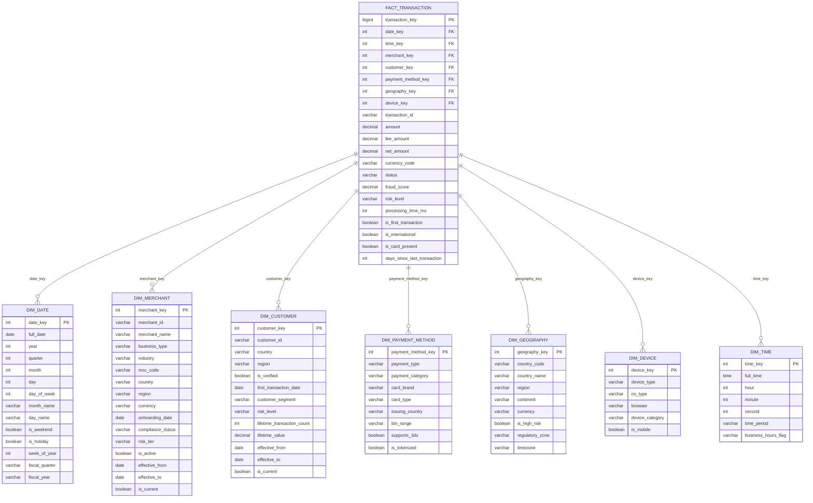
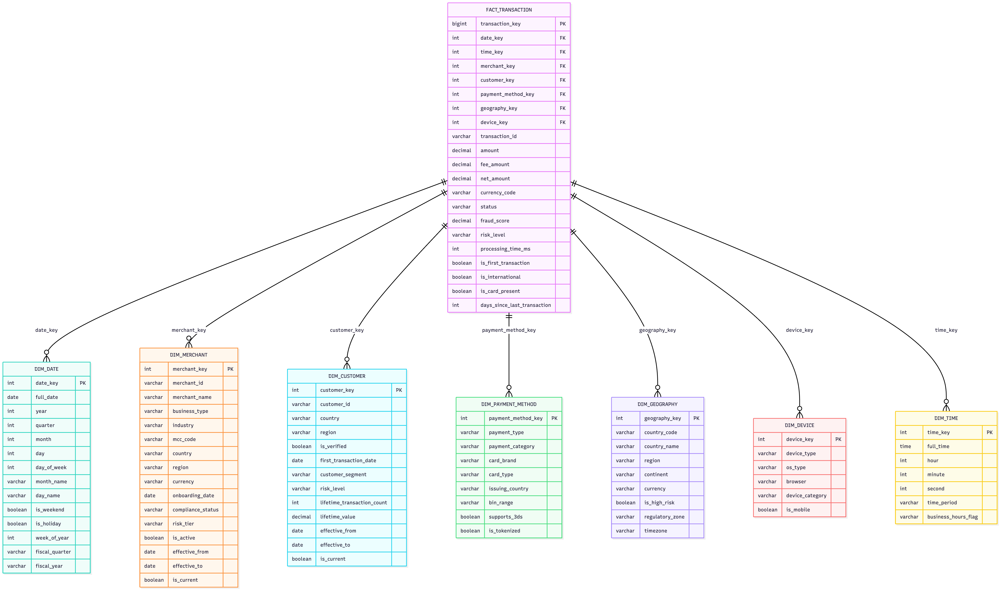

# Modèle OLAP – Schéma en étoile

Ce modèle dimensionnel est conçu pour alimenter les **analyses métier, le reporting et l’analytique prédictive** au sein de la plateforme Stripe. Il repose sur une architecture **star schema** optimisée pour les moteurs analytiques modernes (Snowflake, BigQuery, Redshift, ClickHouse).

## Architecture

- **Une table de faits centrale** : `FACT_TRANSACTION`  
  Représente chaque transaction financière avec des mesures quantitatives et des indicateurs clés (montants, statut, score de fraude, latence, etc.).

- **Dimensions dénormalisées** :  
  - `DIM_DATE` – Calendrier civil et fiscal  
  - `DIM_TIME` – Granularité horaire et période de la journée  
  - `DIM_MERCHANT` – Profil enrichi du marchand (statut, risque, zone réglementaire)  
  - `DIM_CUSTOMER` – Segmentation client et historique (valeur à vie, vérification, segment)  
  - `DIM_PAYMENT_METHOD` – Type, marque et caractéristiques du moyen de paiement  
  - `DIM_GEOGRAPHY` – Localisation avec contexte réglementaire et risque  
  - `DIM_DEVICE` – Contexte technique de l’interaction (mobile, OS, navigateur)

Toutes les dimensions utilisent des **surrogate keys entiers** pour des jointures performantes et supportent l’**historisation des attributs changeants** (SCD Type 2).

## Cas d’usage supportés

- Analyse de revenus par marchand, pays, devise ou segment client  
- Surveillance en temps quasi réel des taux de fraude et de défaillance  
- Segmentation comportementale (première transaction, fréquence, internationalisation)  
- Audit de conformité (transactions depuis des zones à haut risque)  
- Feature engineering pour les modèles de ML (fraude, churn, personnalisation)

## Performances et scalabilité

- Optimisé pour les **requêtes agrégées massives**  
- Compatible avec le **partitionnement par date** et le **clustering multi-colonne**  
- Conçu pour fonctionner à l’échelle **des milliards de transactions**

> Ce modèle s’intègre dans une architecture data moderne alimentée par des pipelines Kafka → Flink → Data Lake → OLAP, assurant cohérence, fraîcheur et traçabilité des données.






## Script SQL de Création OLAP

```
-- =====================================================
-- STRIPE OLAP DATA WAREHOUSE - Snowflake
-- Architecture: Star Schema with SCD Type 2
-- =====================================================

-- Création de la base de données et schema
CREATE DATABASE IF NOT EXISTS STRIPE_DWH;
USE DATABASE STRIPE_DWH;

CREATE SCHEMA IF NOT EXISTS ANALYTICS;
USE SCHEMA ANALYTICS;

-- Configuration du warehouse
CREATE WAREHOUSE IF NOT EXISTS ANALYTICS_WH
  WITH WAREHOUSE_SIZE = 'LARGE'
  AUTO_SUSPEND = 300
  AUTO_RESUME = TRUE
  INITIALLY_SUSPENDED = TRUE
  COMMENT = 'Warehouse for analytical queries';

-- =====================================================
-- DIMENSION TABLES
-- =====================================================

-- Dimension Date (pré-remplie pour 10 ans)
CREATE OR REPLACE TABLE DIM_DATE (
    DATE_KEY INTEGER PRIMARY KEY,
    FULL_DATE DATE NOT NULL UNIQUE,
    YEAR INTEGER NOT NULL,
    QUARTER INTEGER NOT NULL,
    MONTH INTEGER NOT NULL,
    DAY INTEGER NOT NULL,
    DAY_OF_WEEK INTEGER NOT NULL,
    MONTH_NAME VARCHAR(20) NOT NULL,
    DAY_NAME VARCHAR(20) NOT NULL,
    IS_WEEKEND BOOLEAN NOT NULL,
    IS_HOLIDAY BOOLEAN DEFAULT FALSE,
    WEEK_OF_YEAR INTEGER NOT NULL,
    FISCAL_QUARTER VARCHAR(10),
    FISCAL_YEAR INTEGER,
    MONTH_START_DATE DATE,
    MONTH_END_DATE DATE,
    QUARTER_START_DATE DATE,
    QUARTER_END_DATE DATE
) COMMENT = 'Date dimension with calendar and fiscal attributes';

-- Dimension Time (heures, minutes)
CREATE OR REPLACE TABLE DIM_TIME (
    TIME_KEY INTEGER PRIMARY KEY,
    FULL_TIME TIME NOT NULL UNIQUE,
    HOUR INTEGER NOT NULL,
    MINUTE INTEGER NOT NULL,
    SECOND INTEGER NOT NULL,
    TIME_PERIOD VARCHAR(20) NOT NULL, -- Morning, Afternoon, Evening, Night
    BUSINESS_HOURS_FLAG VARCHAR(10) NOT NULL, -- Business, After_Hours
    HOUR_12 INTEGER,
    AM_PM VARCHAR(2)
) COMMENT = 'Time dimension for intraday analysis';

-- Dimension Merchant (SCD Type 2)
CREATE OR REPLACE TABLE DIM_MERCHANT (
    MERCHANT_KEY INTEGER AUTOINCREMENT PRIMARY KEY,
    MERCHANT_ID VARCHAR(50) NOT NULL,
    MERCHANT_NAME VARCHAR(255) NOT NULL,
    BUSINESS_TYPE VARCHAR(50),
    INDUSTRY VARCHAR(100),
    MCC_CODE VARCHAR(4),
    COUNTRY VARCHAR(3),
    REGION VARCHAR(50),
    CURRENCY VARCHAR(3),
    ONBOARDING_DATE DATE,
    COMPLIANCE_STATUS VARCHAR(20),
    RISK_TIER VARCHAR(20),
    IS_ACTIVE BOOLEAN DEFAULT TRUE,
    
    -- SCD Type 2 columns
    EFFECTIVE_FROM TIMESTAMP_NTZ DEFAULT CURRENT_TIMESTAMP(),
    EFFECTIVE_TO TIMESTAMP_NTZ DEFAULT '9999-12-31 23:59:59'::TIMESTAMP_NTZ,
    IS_CURRENT BOOLEAN DEFAULT TRUE,
    
    -- Metadata
    CREATED_AT TIMESTAMP_NTZ DEFAULT CURRENT_TIMESTAMP(),
    UPDATED_AT TIMESTAMP_NTZ DEFAULT CURRENT_TIMESTAMP()
) COMMENT = 'Merchant dimension with SCD Type 2 for historical tracking';

CREATE INDEX IDX_MERCHANT_ID ON DIM_MERCHANT(MERCHANT_ID, IS_CURRENT);

-- Dimension Customer (SCD Type 2)
CREATE OR REPLACE TABLE DIM_CUSTOMER (
    CUSTOMER_KEY INTEGER AUTOINCREMENT PRIMARY KEY,
    CUSTOMER_ID VARCHAR(50) NOT NULL,
    COUNTRY VARCHAR(3),
    REGION VARCHAR(50),
    IS_VERIFIED BOOLEAN DEFAULT FALSE,
    FIRST_TRANSACTION_DATE DATE,
    CUSTOMER_SEGMENT VARCHAR(50), -- High_Value, Regular, New, Dormant
    RISK_LEVEL VARCHAR(20),
    LIFETIME_TRANSACTION_COUNT INTEGER DEFAULT 0,
    LIFETIME_VALUE DECIMAL(18, 2) DEFAULT 0,
    
    -- SCD Type 2 columns
    EFFECTIVE_FROM TIMESTAMP_NTZ DEFAULT CURRENT_TIMESTAMP(),
    EFFECTIVE_TO TIMESTAMP_NTZ DEFAULT '9999-12-31 23:59:59'::TIMESTAMP_NTZ,
    IS_CURRENT BOOLEAN DEFAULT TRUE,
    
    -- Metadata
    CREATED_AT TIMESTAMP_NTZ DEFAULT CURRENT_TIMESTAMP(),
    UPDATED_AT TIMESTAMP_NTZ DEFAULT CURRENT_TIMESTAMP()
) COMMENT = 'Customer dimension with segmentation and lifetime value';

CREATE INDEX IDX_CUSTOMER_ID ON DIM_CUSTOMER(CUSTOMER_ID, IS_CURRENT);
CREATE INDEX IDX_CUSTOMER_SEGMENT ON DIM_CUSTOMER(CUSTOMER_SEGMENT) WHERE IS_CURRENT = TRUE;

-- Dimension Payment Method
CREATE OR REPLACE TABLE DIM_PAYMENT_METHOD (
    PAYMENT_METHOD_KEY INTEGER AUTOINCREMENT PRIMARY KEY,
    PAYMENT_TYPE VARCHAR(50) NOT NULL,
    PAYMENT_CATEGORY VARCHAR(30) NOT NULL, -- card, bank, wallet, crypto
    CARD_BRAND VARCHAR(20),
    CARD_TYPE VARCHAR(20), -- credit, debit, prepaid
    ISSUING_COUNTRY VARCHAR(3),
    BIN_RANGE VARCHAR(10), -- First 6 digits
    SUPPORTS_3DS BOOLEAN DEFAULT FALSE,
    IS_TOKENIZED BOOLEAN DEFAULT FALSE,
    PROCESSING_NETWORK VARCHAR(50),
    
    CREATED_AT TIMESTAMP_NTZ DEFAULT CURRENT_TIMESTAMP()
) COMMENT = 'Payment method dimension with card details';

CREATE INDEX IDX_PAYMENT_TYPE ON DIM_PAYMENT_METHOD(PAYMENT_TYPE);
CREATE INDEX IDX_CARD_BRAND ON DIM_PAYMENT_METHOD(CARD_BRAND);

-- Dimension Geography
CREATE OR REPLACE TABLE DIM_GEOGRAPHY (
    GEOGRAPHY_KEY INTEGER AUTOINCREMENT PRIMARY KEY,
    COUNTRY_CODE VARCHAR(3) NOT NULL UNIQUE,
    COUNTRY_NAME VARCHAR(100) NOT NULL,
    REGION VARCHAR(50),
    CONTINENT VARCHAR(50),
    CURRENCY VARCHAR(3),
    IS_HIGH_RISK BOOLEAN DEFAULT FALSE,
    REGULATORY_ZONE VARCHAR(50), -- EU, US, APAC, etc.
    TIMEZONE VARCHAR(50),
    GDP_PER_CAPITA DECIMAL(18, 2),
    INTERNET_PENETRATION DECIMAL(5, 2),
    
    CREATED_AT TIMESTAMP_NTZ DEFAULT CURRENT_TIMESTAMP(),
    UPDATED_AT TIMESTAMP_NTZ DEFAULT CURRENT_TIMESTAMP()
) COMMENT = 'Geography dimension with regulatory and economic indicators';

-- Dimension Device
CREATE OR REPLACE TABLE DIM_DEVICE (
    DEVICE_KEY INTEGER AUTOINCREMENT PRIMARY KEY,
    DEVICE_TYPE VARCHAR(50),
    OS_TYPE VARCHAR(50),
    BROWSER VARCHAR(50),
    DEVICE_CATEGORY VARCHAR(30), -- Mobile, Desktop, Tablet, IoT
    IS_MOBILE BOOLEAN,
    SCREEN_RESOLUTION VARCHAR(20),
    
    CREATED_AT TIMESTAMP_NTZ DEFAULT CURRENT_TIMESTAMP()
) COMMENT = 'Device dimension for transaction channel analysis';

CREATE INDEX IDX_DEVICE_CATEGORY ON DIM_DEVICE(DEVICE_CATEGORY);

-- =====================================================
-- FACT TABLES
-- =====================================================

-- Fact Transaction (principale table de faits)
CREATE OR REPLACE TABLE FACT_TRANSACTION (
    TRANSACTION_KEY BIGINT AUTOINCREMENT PRIMARY KEY,
    
    -- Foreign Keys vers dimensions
    DATE_KEY INTEGER NOT NULL,
    TIME_KEY INTEGER NOT NULL,
    MERCHANT_KEY INTEGER NOT NULL,
    CUSTOMER_KEY INTEGER NOT NULL,
    PAYMENT_METHOD_KEY INTEGER NOT NULL,
    GEOGRAPHY_KEY INTEGER NOT NULL,
    DEVICE_KEY INTEGER,
    
    -- Degenerate Dimensions (IDs originaux)
    TRANSACTION_ID VARCHAR(50) NOT NULL,
    EXTERNAL_REFERENCE VARCHAR(100),
    
    -- Mesures additives
    AMOUNT DECIMAL(18, 2) NOT NULL,
    FEE_AMOUNT DECIMAL(18, 2) DEFAULT 0,
    NET_AMOUNT DECIMAL(18, 2),
    REFUND_AMOUNT DECIMAL(18, 2) DEFAULT 0,
    CHARGEBACK_AMOUNT DECIMAL(18, 2) DEFAULT 0,
    
    -- Mesures en USD (pour consolidation multi-devises)
    AMOUNT_USD DECIMAL(18, 2),
    NET_AMOUNT_USD DECIMAL(18, 2),
    
    -- Mesures semi-additives
    CURRENCY_CODE VARCHAR(3) NOT NULL,
    EXCHANGE_RATE_TO_USD DECIMAL(18, 6),
    
    -- Mesures non-additives
    STATUS VARCHAR(20) NOT NULL,
    FRAUD_SCORE DECIMAL(5, 4),
    RISK_LEVEL VARCHAR(20),
    PROCESSING_TIME_MS INTEGER,
    
    -- Flags booléens pour analyses
    IS_FIRST_TRANSACTION BOOLEAN DEFAULT FALSE,
    IS_INTERNATIONAL BOOLEAN DEFAULT FALSE,
    IS_CARD_PRESENT BOOLEAN DEFAULT FALSE,
    IS_RECURRING BOOLEAN DEFAULT FALSE,
    IS_REFUNDED BOOLEAN DEFAULT FALSE,
    IS_DISPUTED BOOLEAN DEFAULT FALSE,
    HAS_3DS BOOLEAN DEFAULT FALSE,
    
    -- Métriques calculées
    DAYS_SINCE_LAST_TRANSACTION INTEGER,
    TRANSACTION_HOUR_OF_DAY INTEGER,
    
    -- Metadata
    CREATED_AT TIMESTAMP_NTZ DEFAULT CURRENT_TIMESTAMP(),
    LOADED_AT TIMESTAMP_NTZ DEFAULT CURRENT_TIMESTAMP(),
    SOURCE_SYSTEM VARCHAR(50) DEFAULT 'OLTP'
) 
CLUSTER BY (DATE_KEY, MERCHANT_KEY)
COMMENT = 'Main transaction fact table with all measures and flags';

-- Contraintes de clés étrangères (pour documentation, non enforced dans Snowflake)
ALTER TABLE FACT_TRANSACTION ADD CONSTRAINT FK_TRANSACTION_DATE 
    FOREIGN KEY (DATE_KEY) REFERENCES DIM_DATE(DATE_KEY) NOT ENFORCED;
    
ALTER TABLE FACT_TRANSACTION ADD CONSTRAINT FK_TRANSACTION_MERCHANT 
    FOREIGN KEY (MERCHANT_KEY) REFERENCES DIM_MERCHANT(MERCHANT_KEY) NOT ENFORCED;
    
ALTER TABLE FACT_TRANSACTION ADD CONSTRAINT FK_TRANSACTION_CUSTOMER 
    FOREIGN KEY (CUSTOMER_KEY) REFERENCES DIM_CUSTOMER(CUSTOMER_KEY) NOT ENFORCED;

-- Index pour performance
CREATE INDEX IDX_FACT_TXN_DATE ON FACT_TRANSACTION(DATE_KEY);
CREATE INDEX IDX_FACT_TXN_MERCHANT ON FACT_TRANSACTION(MERCHANT_KEY, DATE_KEY);
CREATE INDEX IDX_FACT_TXN_STATUS ON FACT_TRANSACTION(STATUS, DATE_KEY);
CREATE INDEX IDX_FACT_TXN_ID ON FACT_TRANSACTION(TRANSACTION_ID);

-- Fact Subscription (pour analyse des abonnements)
CREATE OR REPLACE TABLE FACT_SUBSCRIPTION (
    SUBSCRIPTION_KEY BIGINT AUTOINCREMENT PRIMARY KEY,
    
    -- Dimensions
    DATE_KEY INTEGER NOT NULL,
    MERCHANT_KEY INTEGER NOT NULL,
    CUSTOMER_KEY INTEGER NOT NULL,
    
    -- Degenerate Dimensions
    SUBSCRIPTION_ID VARCHAR(50) NOT NULL,
    PLAN_ID VARCHAR(50),
    
    -- Mesures
    MRR DECIMAL(18, 2), -- Monthly Recurring Revenue
    ARR DECIMAL(18, 2), -- Annual Recurring Revenue
    SUBSCRIPTION_AMOUNT DECIMAL(18, 2),
    CURRENCY_CODE VARCHAR(3),
    
    -- Status et flags
    STATUS VARCHAR(20),
    BILLING_CYCLE VARCHAR(20),
    IS_TRIAL BOOLEAN DEFAULT FALSE,
    IS_CHURNED BOOLEAN DEFAULT FALSE,
    
    -- Dates importantes
    START_DATE DATE,
    END_DATE DATE,
    CHURN_DATE DATE,
    
    -- Métriques
    DAYS_ACTIVE INTEGER,
    PAYMENTS_MADE INTEGER DEFAULT 0,
    PAYMENTS_FAILED INTEGER DEFAULT 0,
    
    CREATED_AT TIMESTAMP_NTZ DEFAULT CURRENT_TIMESTAMP(),
    LOADED_AT TIMESTAMP_NTZ DEFAULT CURRENT_TIMESTAMP()
) 
CLUSTER BY (DATE_KEY, MERCHANT_KEY)
COMMENT = 'Subscription fact table for MRR/ARR analysis';

-- Fact Fraud Detection (pour analyse anti-fraude)
CREATE OR REPLACE TABLE FACT_FRAUD_DETECTION (
    FRAUD_KEY BIGINT AUTOINCREMENT PRIMARY KEY,
    
    TRANSACTION_KEY BIGINT,
    DATE_KEY INTEGER NOT NULL,
    TIME_KEY INTEGER NOT NULL,
    MERCHANT_KEY INTEGER NOT NULL,
    GEOGRAPHY_KEY INTEGER NOT NULL,
    
    -- Métriques de fraude
    FRAUD_SCORE DECIMAL(5, 4) NOT NULL,
    RISK_LEVEL VARCHAR(20),
    MODEL_VERSION VARCHAR(20),
    
    -- Indicateurs de risque
    VELOCITY_CHECK_FAILED BOOLEAN DEFAULT FALSE,
    GEOLOCATION_MISMATCH BOOLEAN DEFAULT FALSE,
    DEVICE_FINGERPRINT_SUSPICIOUS BOOLEAN DEFAULT FALSE,
    BIN_MISMATCH BOOLEAN DEFAULT FALSE,
    AMOUNT_ANOMALY BOOLEAN DEFAULT FALSE,
    
    -- Résolution
    REQUIRES_REVIEW BOOLEAN DEFAULT FALSE,
    REVIEWED_AT TIMESTAMP_NTZ,
    REVIEW_DECISION VARCHAR(20),
    IS_FRAUD_CONFIRMED BOOLEAN,
    
    -- Coûts
    FRAUD_LOSS_AMOUNT DECIMAL(18, 2),
    CHARGEBACK_COST DECIMAL(18, 2),
    
    CREATED_AT TIMESTAMP_NTZ DEFAULT CURRENT_TIMESTAMP()
) 
CLUSTER BY (DATE_KEY)
COMMENT = 'Fraud detection fact table with risk indicators';

-- =====================================================
-- TABLES D'AGRÉGATION PRÉ-CALCULÉES
-- =====================================================

-- Agrégation quotidienne par merchant
CREATE OR REPLACE TABLE AGG_MERCHANT_DAILY (
    MERCHANT_KEY INTEGER NOT NULL,
    DATE_KEY INTEGER NOT NULL,
    CURRENCY_CODE VARCHAR(3),
    
    -- Métriques transactionnelles
    TRANSACTION_COUNT INTEGER,
    SUCCESSFUL_TRANSACTIONS INTEGER,
    FAILED_TRANSACTIONS INTEGER,
    TOTAL_AMOUNT DECIMAL(18, 2),
    TOTAL_FEES DECIMAL(18, 2),
    NET_REVENUE DECIMAL(18, 2),
    AVG_TRANSACTION_AMOUNT DECIMAL(18, 2),
    
    -- Métriques en USD
    TOTAL_AMOUNT_USD DECIMAL(18, 2),
    NET_REVENUE_USD DECIMAL(18, 2),
    
    -- Métriques clients
    UNIQUE_CUSTOMERS INTEGER,
    NEW_CUSTOMERS INTEGER,
    RETURNING_CUSTOMERS INTEGER,
    
    -- Métriques de fraude
    FRAUD_TRANSACTIONS INTEGER,
    FRAUD_AMOUNT DECIMAL(18, 2),
    AVG_FRAUD_SCORE DECIMAL(5, 4),
    
    -- Métriques de refund
    REFUND_COUNT INTEGER,
    REFUND_AMOUNT DECIMAL(18, 2),
    REFUND_RATE DECIMAL(5, 4),
    
    -- Métriques de performance
    AVG_PROCESSING_TIME_MS INTEGER,
    P95_PROCESSING_TIME_MS INTEGER,
    
    LOADED_AT TIMESTAMP_NTZ DEFAULT CURRENT_TIMESTAMP(),
    
    PRIMARY KEY (MERCHANT_KEY, DATE_KEY, CURRENCY_CODE)
) 
CLUSTER BY (DATE_KEY)
COMMENT = 'Daily aggregated metrics by merchant';

-- Agrégation mensuelle pour analyse de tendances
CREATE OR REPLACE TABLE AGG_MERCHANT_MONTHLY (
    MERCHANT_KEY INTEGER NOT NULL,
    YEAR INTEGER NOT NULL,
    MONTH INTEGER NOT NULL,
    CURRENCY_CODE VARCHAR(3),
    
    -- Métriques mensuelles
    TRANSACTION_COUNT INTEGER,
    TOTAL_REVENUE DECIMAL(18, 2),
    NET_REVENUE DECIMAL(18, 2),
    AVG_TRANSACTION_AMOUNT DECIMAL(18, 2),
    
    -- Métriques de croissance (MoM)
    REVENUE_GROWTH_PCT DECIMAL(5, 2),
    TRANSACTION_GROWTH_PCT DECIMAL(5, 2),
    
    -- Customer metrics
    ACTIVE_CUSTOMERS INTEGER,
    NEW_CUSTOMERS INTEGER,
    CHURNED_CUSTOMERS INTEGER,
    CUSTOMER_RETENTION_RATE DECIMAL(5, 4),
    
    -- Subscription metrics (si applicable)
    MRR DECIMAL(18, 2),
    ARR DECIMAL(18, 2),
    
    LOADED_AT TIMESTAMP_NTZ DEFAULT CURRENT_TIMESTAMP(),
    
    PRIMARY KEY (MERCHANT_KEY, YEAR, MONTH, CURRENCY_CODE)
) COMMENT = 'Monthly aggregated metrics with growth indicators';

-- Agrégation par segment client
CREATE OR REPLACE TABLE AGG_CUSTOMER_SEGMENT_DAILY (
    CUSTOMER_SEGMENT VARCHAR(50) NOT NULL,
    DATE_KEY INTEGER NOT NULL,
    GEOGRAPHY_KEY INTEGER NOT NULL,
    
    -- Métriques de segment
    CUSTOMER_COUNT INTEGER,
    TRANSACTION_COUNT INTEGER,
    TOTAL_REVENUE DECIMAL(18, 2),
    AVG_TRANSACTION_VALUE DECIMAL(18, 2),
    AVG_LIFETIME_VALUE DECIMAL(18, 2),
    
    -- Comportement
    AVG_TRANSACTIONS_PER_CUSTOMER DECIMAL(10, 2),
    AVG_DAYS_BETWEEN_TRANSACTIONS DECIMAL(10, 2),
    
    LOADED_AT TIMESTAMP_NTZ DEFAULT CURRENT_TIMESTAMP(),
    
    PRIMARY KEY (CUSTOMER_SEGMENT, DATE_KEY, GEOGRAPHY_KEY)
) COMMENT = 'Daily customer segment analysis';

-- =====================================================
-- VUES POUR ANALYSES FRÉQUENTES
-- =====================================================

-- Vue pour analyse de revenus en temps réel (derniers 7 jours)
CREATE OR REPLACE VIEW VW_REVENUE_LAST_7_DAYS AS
SELECT 
    d.FULL_DATE,
    dm.MERCHANT_NAME,
    dm.COUNTRY,
    ft.CURRENCY_CODE,
    COUNT(*) AS transaction_count,
    SUM(ft.AMOUNT) AS total_revenue,
    SUM(ft.NET_AMOUNT) AS net_revenue,
    SUM(ft.FEE_AMOUNT) AS total_fees,
    AVG(ft.AMOUNT) AS avg_transaction_amount,
    COUNT(DISTINCT ft.CUSTOMER_KEY) AS unique_customers
FROM FACT_TRANSACTION ft
INNER JOIN DIM_DATE d ON ft.DATE_KEY = d.DATE_KEY
INNER JOIN DIM_MERCHANT dm ON ft.MERCHANT_KEY = dm.MERCHANT_KEY AND dm.IS_CURRENT = TRUE
WHERE d.FULL_DATE >= DATEADD('day', -7, CURRENT_DATE())
    AND ft.STATUS = 'succeeded'
GROUP BY d.FULL_DATE, dm.MERCHANT_NAME, dm.COUNTRY, ft.CURRENCY_CODE;

-- Vue pour détection de fraude haute priorité
CREATE OR REPLACE VIEW VW_HIGH_RISK_TRANSACTIONS AS
SELECT 
    ft.TRANSACTION_ID,
    d.FULL_DATE,
    t.FULL_TIME,
    dm.MERCHANT_NAME,
    dc.COUNTRY AS customer_country,
    ft.AMOUNT,
    ft.CURRENCY_CODE,
    ffd.FRAUD_SCORE,
    ffd.RISK_LEVEL,
    ffd.REQUIRES_REVIEW,
    ffd.VELOCITY_CHECK_FAILED,
    ffd.GEOLOCATION_MISMATCH,
    ffd.AMOUNT_ANOMALY
FROM FACT_FRAUD_DETECTION ffd
INNER JOIN FACT_TRANSACTION ft ON ffd.TRANSACTION_KEY = ft.TRANSACTION_KEY
INNER JOIN DIM_DATE d ON ffd.DATE_KEY = d.DATE_KEY
INNER JOIN DIM_TIME t ON ffd.TIME_KEY = t.TIME_KEY
INNER JOIN DIM_MERCHANT dm ON ffd.MERCHANT_KEY = dm.MERCHANT_KEY AND dm.IS_CURRENT = TRUE
INNER JOIN DIM_CUSTOMER dc ON ft.CUSTOMER_KEY = dc.CUSTOMER_KEY AND dc.IS_CURRENT = TRUE
WHERE ffd.RISK_LEVEL IN ('high', 'very_high')
    AND ffd.REVIEWED_AT IS NULL
    AND d.FULL_DATE >= DATEADD('day', -30, CURRENT_DATE());

-- =====================================================
-- PROCÉDURES STOCKÉES POUR ETL
-- =====================================================

-- Procédure pour charger les dimensions depuis OLTP
CREATE OR REPLACE PROCEDURE SP_LOAD_DIM_MERCHANT()
RETURNS STRING
LANGUAGE SQL
AS
$$
BEGIN
    -- Insertion des nouveaux merchants
    INSERT INTO DIM_MERCHANT (
        MERCHANT_ID, MERCHANT_NAME, BUSINESS_TYPE, INDUSTRY, 
        MCC_CODE, COUNTRY, REGION, CURRENCY, 
        ONBOARDING_DATE, COMPLIANCE_STATUS, RISK_TIER, IS_ACTIVE
    )
    SELECT 
        m.merchant_id,
        m.merchant_name,
        m.business_type,
        mp.industry,
        m.mcc_code,
        m.country_code,
        c.region,
        m.currency_code,
        m.created_at::DATE,
        mp.compliance_status,
        'standard' AS risk_tier,
        m.is_active
    FROM STRIPE_OLTP.PUBLIC.MERCHANT m
    LEFT JOIN STRIPE_OLTP.PUBLIC.MERCHANT_PROFILE mp ON m.merchant_id = mp.merchant_id
    LEFT JOIN STRIPE_OLTP.PUBLIC.COUNTRY c ON m.country_code = c.country_code
    WHERE NOT EXISTS (
        SELECT 1 FROM DIM_MERCHANT dm 
        WHERE dm.MERCHANT_ID = m.merchant_id AND dm.IS_CURRENT = TRUE
    );
    
    -- SCD Type 2: Update des merchants existants avec changements
    -- (Fermer l'ancien record et créer un nouveau)
    UPDATE DIM_MERCHANT
    SET EFFECTIVE_TO = CURRENT_TIMESTAMP(),
        IS_CURRENT = FALSE
    WHERE MERCHANT_ID IN (
        SELECT dm.MERCHANT_ID
        FROM DIM_MERCHANT dm
        INNER JOIN STRIPE_OLTP.PUBLIC.MERCHANT m ON dm.MERCHANT_ID = m.merchant_id
        WHERE dm.IS_CURRENT = TRUE
        AND (
            dm.MERCHANT_NAME != m.merchant_name OR
            dm.COMPLIANCE_STATUS != (SELECT compliance_status FROM STRIPE_OLTP.PUBLIC.MERCHANT_PROFILE WHERE merchant_id = m.merchant_id)
        )
    )
    AND IS_CURRENT = TRUE;
    
    RETURN 'DIM_MERCHANT loaded successfully';
END;
$$;

-- Procédure pour charger les faits de transaction
CREATE OR REPLACE PROCEDURE SP_LOAD_FACT_TRANSACTION(P_START_DATE DATE, P_END_DATE DATE)
RETURNS STRING
LANGUAGE SQL
AS
$$
BEGIN
    INSERT INTO FACT_TRANSACTION (
        DATE_KEY, TIME_KEY, MERCHANT_KEY, CUSTOMER_KEY, 
        PAYMENT_METHOD_KEY, GEOGRAPHY_KEY, DEVICE_KEY,
        TRANSACTION_ID, AMOUNT, FEE_AMOUNT, NET_AMOUNT,
        CURRENCY_CODE, STATUS, FRAUD_SCORE, RISK_LEVEL,
        IS_FIRST_TRANSACTION, IS_INTERNATIONAL, PROCESSING_TIME_MS
    )
    SELECT 
        dd.DATE_KEY,
        dt.TIME_KEY,
        dm.MERCHANT_KEY,
        dc.CUSTOMER_KEY,
        dpm.PAYMENT_METHOD_KEY,
        dg.GEOGRAPHY_KEY,
        ddv.DEVICE_KEY,
        t.transaction_id,
        t.amount,
        t.fee_amount,
        t.net_amount,
        t.currency_code,
        t.status,
        fs.fraud_score,
        fs.risk_level,
        (cp.lifetime_transactions = 1) AS is_first_transaction,
        (t.country_code != m.country_code) AS is_international,
        DATEDIFF('millisecond', t.created_at, t.updated_at) AS processing_time_ms
    FROM STRIPE_OLTP.PUBLIC.TRANSACTION t
    INNER JOIN STRIPE_OLTP.PUBLIC.MERCHANT m ON t.merchant_id = m.merchant_id
    INNER JOIN DIM_MERCHANT dm ON m.merchant_id = dm.MERCHANT_ID AND dm.IS_CURRENT = TRUE
    INNER JOIN DIM_CUSTOMER dc ON t.customer_id = dc.CUSTOMER_ID AND dc.IS_CURRENT = TRUE
    INNER JOIN DIM_DATE dd ON t.transaction_date::DATE = dd.FULL_DATE
    INNER JOIN DIM_TIME dt ON t.transaction_date::TIME = dt.FULL_TIME
    LEFT JOIN STRIPE_OLTP.PUBLIC.CUSTOMER_PROFILE cp ON t.customer_id = cp.customer_id
    LEFT JOIN STRIPE_OLTP.PUBLIC.FRAUD_SCORE fs ON t.transaction_id = fs.transaction_id
    LEFT JOIN DIM_GEOGRAPHY dg ON t.country_code = dg.COUNTRY_CODE
    LEFT JOIN DIM_PAYMENT_METHOD dpm ON /* join logic */
    LEFT JOIN DIM_DEVICE ddv ON /* join logic */
    WHERE t.transaction_date::DATE BETWEEN P_START_DATE AND P_END_DATE
    AND NOT EXISTS (
        SELECT 1 FROM FACT_TRANSACTION ft WHERE ft.TRANSACTION_ID = t.transaction_id
    );
    
    RETURN 'FACT_TRANSACTION loaded for date range: ' || P_START_DATE || ' to ' || P_END_DATE;
END;
$$;

-- =====================================================
-- TASKS POUR CHARGEMENT AUTOMATIQUE
-- =====================================================

-- Task quotidien pour charger les nouvelles transactions
CREATE OR REPLACE TASK TASK_DAILY_TRANSACTION_LOAD
    WAREHOUSE = ANALYTICS_WH
    SCHEDULE = 'USING CRON 0 2 * * * UTC' -- 2 AM daily
AS
    CALL SP_LOAD_FACT_TRANSACTION(DATEADD('day', -1, CURRENT_DATE()), CURRENT_DATE());

-- Task pour refresh des agrégations
CREATE OR REPLACE TASK TASK_REFRESH_AGGREGATIONS
    WAREHOUSE = ANALYTICS_WH
    SCHEDULE = 'USING CRON 0 3 * * * UTC' -- 3 AM daily
AS
BEGIN
    DELETE FROM AGG_MERCHANT_DAILY WHERE DATE_KEY >= (SELECT DATE_KEY FROM DIM_DATE WHERE FULL_DATE = DATEADD('day', -1, CURRENT_DATE()));
    
    INSERT INTO AGG_MERCHANT_DAILY
    SELECT 
        ft.MERCHANT_KEY,
        ft.DATE_KEY,
        ft.CURRENCY_CODE,
        COUNT(*) AS transaction_count,
        COUNT(*) FILTER (WHERE ft.STATUS = 'succeeded') AS successful_transactions,
        COUNT(*) FILTER (WHERE ft.STATUS = 'failed') AS failed_transactions,
        SUM(ft.AMOUNT) FILTER (WHERE ft.STATUS = 'succeeded') AS total_amount,
        SUM(ft.FEE_AMOUNT) FILTER (WHERE ft.STATUS = 'succeeded') AS total_fees,
        SUM(ft.NET_AMOUNT) FILTER (WHERE ft.STATUS = 'succeeded') AS net_revenue,
        AVG(ft.AMOUNT) FILTER (WHERE ft.STATUS = 'succeeded') AS avg_transaction_amount,
        COUNT(DISTINCT ft.CUSTOMER_KEY) AS unique_customers,
        /* autres métriques... */
        CURRENT_TIMESTAMP() AS loaded_at
    FROM FACT_TRANSACTION ft
    WHERE ft.DATE_KEY >= (SELECT DATE_KEY FROM DIM_DATE WHERE FULL_DATE = DATEADD('day', -1, CURRENT_DATE()))
    GROUP BY ft.MERCHANT_KEY, ft.DATE_KEY, ft.CURRENCY_CODE;
END;

-- Activer les tasks
ALTER TASK TASK_DAILY_TRANSACTION_LOAD RESUME;
ALTER TASK TASK_REFRESH_AGGREGATIONS RESUME;

-- =====================================================
-- CONFIGURATION DE SÉCURITÉ
-- =====================================================

-- Role pour utilisateurs BI
CREATE ROLE IF NOT EXISTS ANALYTICS_READER;
GRANT USAGE ON DATABASE STRIPE_DWH TO ROLE ANALYTICS_READER;
GRANT USAGE ON SCHEMA ANALYTICS TO ROLE ANALYTICS_READER;
GRANT SELECT ON ALL TABLES IN SCHEMA ANALYTICS TO ROLE ANALYTICS_READER;
GRANT SELECT ON ALL VIEWS IN SCHEMA ANALYTICS TO ROLE ANALYTICS_READER;
GRANT USAGE ON WAREHOUSE ANALYTICS_WH TO ROLE ANALYTICS_READER;

-- Masking policy pour données sensibles
CREATE OR REPLACE MASKING POLICY EMAIL_MASK AS (VAL STRING) RETURNS STRING ->
    CASE
        WHEN CURRENT_ROLE() IN ('ACCOUNTADMIN', 'ANALYTICS_ADMIN') THEN VAL
        ELSE '***@***.**'
    END;

-- Row Access Policy pour multi-tenancy
CREATE OR REPLACE ROW ACCESS POLICY MERCHANT_ISOLATION AS (MERCHANT_KEY NUMBER) RETURNS BOOLEAN ->
    CASE
        WHEN CURRENT_ROLE() IN ('ACCOUNTADMIN') THEN TRUE
        WHEN IS_ROLE_IN_SESSION('ANALYTICS_READER') THEN 
            MERCHANT_KEY IN (SELECT merchant_key FROM USER_MERCHANT_ACCESS WHERE USER_NAME = CURRENT_USER())
        ELSE FALSE
    END;

-- Appliquer les policies
ALTER TABLE FACT_TRANSACTION ADD ROW ACCESS POLICY MERCHANT_ISOLATION ON (MERCHANT_KEY);

COMMENT ON DATABASE STRIPE_DWH IS 'Stripe Data Warehouse - OLAP System for Analytics';

```
