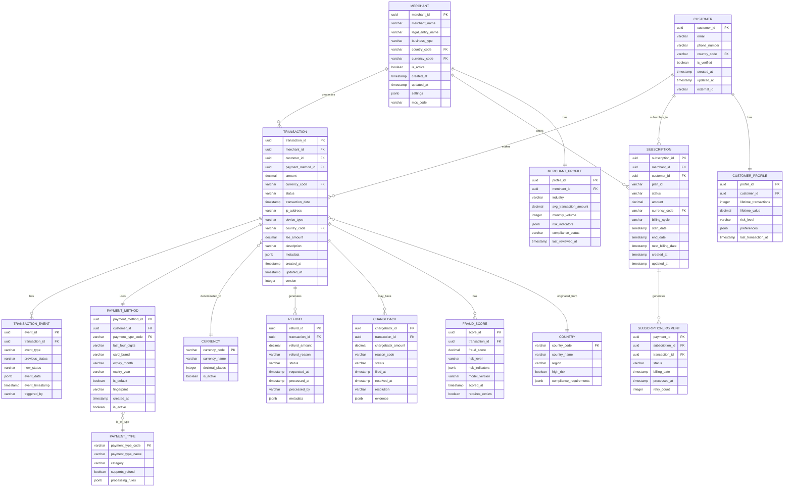

```mermaid

erDiagram
    MERCHANT ||--o{ TRANSACTION : processes
    CUSTOMER ||--o{ TRANSACTION : makes
    TRANSACTION ||--o{ TRANSACTION_EVENT : has
    TRANSACTION ||--|| PAYMENT_METHOD : uses
    TRANSACTION }o--|| CURRENCY : denominated_in
    TRANSACTION ||--o{ REFUND : generates
    TRANSACTION ||--o{ CHARGEBACK : may_have
    MERCHANT ||--o{ SUBSCRIPTION : offers
    CUSTOMER ||--o{ SUBSCRIPTION : subscribes_to
    SUBSCRIPTION ||--o{ SUBSCRIPTION_PAYMENT : generates
    TRANSACTION ||--o{ FRAUD_SCORE : has
    CUSTOMER ||--|| CUSTOMER_PROFILE : has
    MERCHANT ||--|| MERCHANT_PROFILE : has
    TRANSACTION }o--|| COUNTRY : originated_from
    PAYMENT_METHOD }o--|| PAYMENT_TYPE : is_of_type

    MERCHANT {
        uuid merchant_id PK
        varchar merchant_name
        varchar legal_entity_name
        varchar business_type
        varchar country_code FK
        varchar currency_code FK
        boolean is_active
        timestamp created_at
        timestamp updated_at
        jsonb settings
        varchar mcc_code
    }

    MERCHANT_PROFILE {
        uuid profile_id PK
        uuid merchant_id FK
        varchar industry
        decimal avg_transaction_amount
        integer monthly_volume
        jsonb risk_indicators
        varchar compliance_status
        timestamp last_reviewed_at
    }

    CUSTOMER {
        uuid customer_id PK
        varchar email
        varchar phone_number
        varchar country_code FK
        boolean is_verified
        timestamp created_at
        timestamp updated_at
        varchar external_id
    }

    CUSTOMER_PROFILE {
        uuid profile_id PK
        uuid customer_id FK
        integer lifetime_transactions
        decimal lifetime_value
        varchar risk_level
        jsonb preferences
        timestamp last_transaction_at
    }

    TRANSACTION {
        uuid transaction_id PK
        uuid merchant_id FK
        uuid customer_id FK
        uuid payment_method_id FK
        decimal amount
        varchar currency_code FK
        varchar status
        timestamp transaction_date
        varchar ip_address
        varchar device_type
        varchar country_code FK
        decimal fee_amount
        varchar description
        jsonb metadata
        timestamp created_at
        timestamp updated_at
        integer version
    }

    TRANSACTION_EVENT {
        uuid event_id PK
        uuid transaction_id FK
        varchar event_type
        varchar previous_status
        varchar new_status
        jsonb event_data
        timestamp event_timestamp
        varchar triggered_by
    }

    PAYMENT_METHOD {
        uuid payment_method_id PK
        uuid customer_id FK
        varchar payment_type_code FK
        varchar last_four_digits
        varchar card_brand
        varchar expiry_month
        varchar expiry_year
        boolean is_default
        varchar fingerprint
        timestamp created_at
        boolean is_active
    }

    PAYMENT_TYPE {
        varchar payment_type_code PK
        varchar payment_type_name
        varchar category
        boolean supports_refund
        jsonb processing_rules
    }

    REFUND {
        uuid refund_id PK
        uuid transaction_id FK
        decimal refund_amount
        varchar refund_reason
        varchar status
        timestamp requested_at
        timestamp processed_at
        varchar processed_by
        jsonb metadata
    }

    CHARGEBACK {
        uuid chargeback_id PK
        uuid transaction_id FK
        decimal chargeback_amount
        varchar reason_code
        varchar status
        timestamp filed_at
        timestamp resolved_at
        varchar resolution
        jsonb evidence
    }

    SUBSCRIPTION {
        uuid subscription_id PK
        uuid merchant_id FK
        uuid customer_id FK
        varchar plan_id
        varchar status
        decimal amount
        varchar currency_code FK
        varchar billing_cycle
        timestamp start_date
        timestamp end_date
        timestamp next_billing_date
        timestamp created_at
        timestamp updated_at
    }

    SUBSCRIPTION_PAYMENT {
        uuid payment_id PK
        uuid subscription_id FK
        uuid transaction_id FK
        varchar status
        timestamp billing_date
        timestamp processed_at
        integer retry_count
    }

    FRAUD_SCORE {
        uuid score_id PK
        uuid transaction_id FK
        decimal fraud_score
        varchar risk_level
        jsonb risk_indicators
        varchar model_version
        timestamp scored_at
        boolean requires_review
    }

    CURRENCY {
        varchar currency_code PK
        varchar currency_name
        integer decimal_places
        boolean is_active
    }

    COUNTRY {
        varchar country_code PK
        varchar country_name
        varchar region
        boolean high_risk
        jsonb compliance_requirements
    }
```