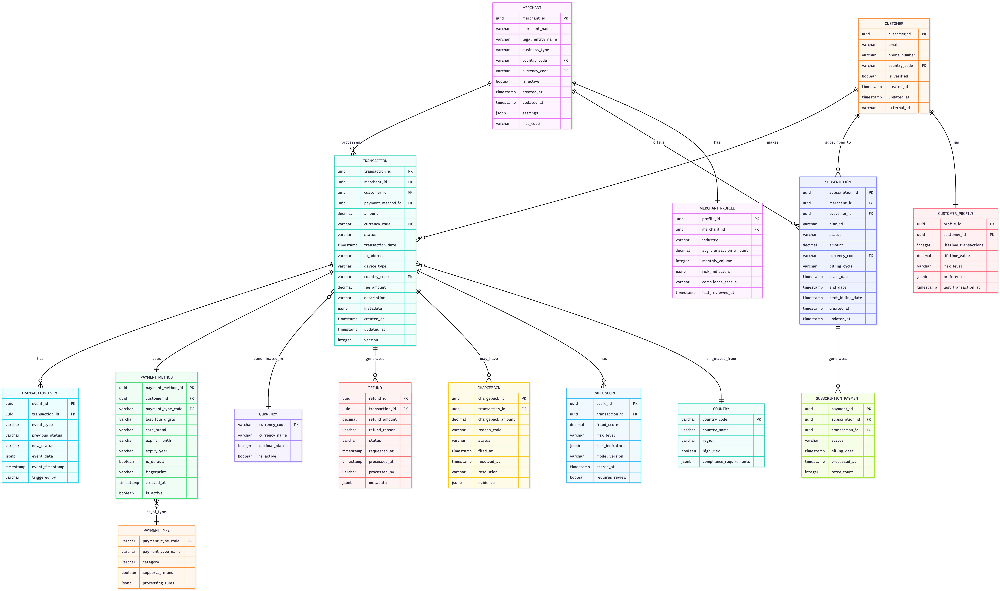

## Modèle de Données OLTP

Le modèle OLTP conçu pour Stripe répond aux exigences critiques d’une plateforme FinTech à très haut débit, avec un accent sur la conformité, l’intégrité des données et la scalabilité.

## ✅ Respect strict de la 3ᵉ forme normale (3NF)
- Élimination des redondances (ex: `country_name` stocké une seule fois dans `COUNTRY`)
- Réduction des anomalies de mise à jour
- Cohérence maximale des données critiques (montants, statuts, devises)

## 🔗 Relations explicites au lieu de many-to-many implicites
- Toute association complexe devient une entité métier à part entière (ex: `SUBSCRIPTION`, `TRANSACTION_EVENT`, `FRAUD_SCORE`)
- Permet de capturer des attributs temporels, des métadonnées et un historique (ex: événements de statut, dates de remboursement)

## 🕵️ Traçabilité et auditabilité native
- Chaque entité comporte `created_at` / `updated_at`
- Les changements d’état sont historisés via `TRANSACTION_EVENT`
- Essentiel pour la conformité PCI-DSS, GDPR et les enquêtes de fraude

## 🧩 Extensibilité via `jsonb` sans compromis structurel
- Champs comme `metadata`, `risk_indicators`, `evidence` permettent d’ajouter des données sans modifier le schéma
- Idéal pour les intégrations rapides (nouveaux PSP, réglementations locales) tout en gardant les colonnes critiques typées (ex: `amount`, `currency_code`)

## 🔒 Séparation claire des responsabilités
- `CUSTOMER` vs `CUSTOMER_PROFILE` : les données d’identité sont séparées des agrégats analytiques
- Permet des accès différenciés (ex: support accède au client, ML accède au profil)
- Réduit la surface d’attaque (moins de données sensibles exposées)

## 🔄 Préparation native pour le CDC (Change Data Capture)
- Clés primaires UUID, versioning (`version` dans `TRANSACTION`)
- Modèle idéal pour alimenter Kafka via Debezium sans transformation complexe
- Base solide pour l’architecture Lambda (batch + streaming)

## 💼 Alignement avec les exigences métier FinTech
- Modélisation fine des concepts clés : remboursements, chargebacks, abonnements, fraude
- Chaque opération financière est traçable, annulable (logiquement) et justifiable — crucial pour les audits

## ⚡ Performance transactionnelle optimisée
- Indexation implicite via les clés étrangères
- Tables étroites (pas de colonnes inutiles dans `TRANSACTION`)
- Faible latence même sous forte charge (OLTP distribué compatible avec CockroachDB/PostgreSQL)

