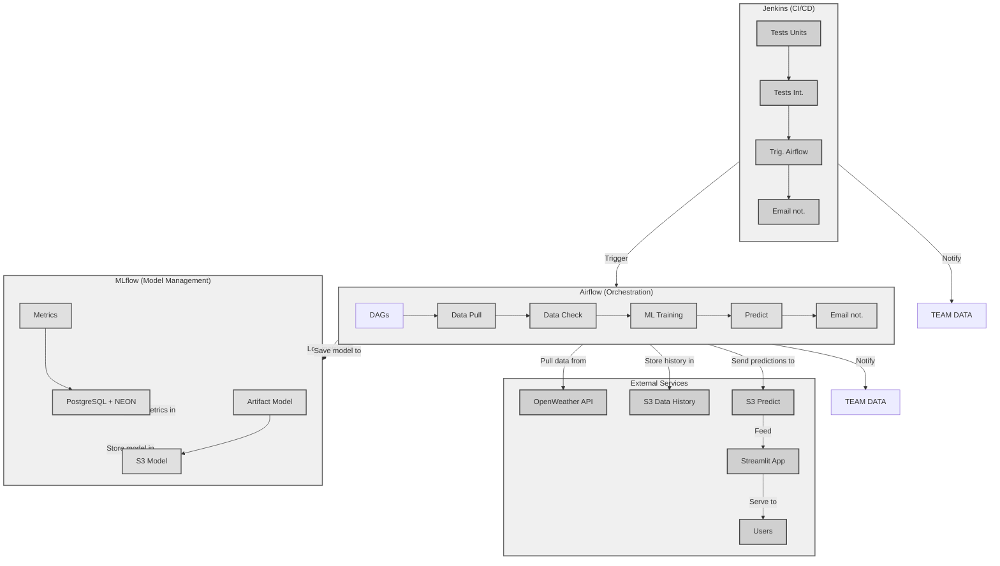

# AIA - BLOC_04 : Projet Météo - ML Pipeline

## Présentation en ligne de l'intégralité du projet

🚀 [Bloc_04 | PROJET MÉTÈO | Présentation PPT](https://docs.google.com/presentation/d/1nWi3Q9N6SFRfRQldj1ZbB49OlgcXWEltxNtJOjyxBNA/edit?usp=sharing) \
📁 [Bloc_04 | PROJET MÉTÈO | Backup sur GitHub]()


Un projet de machine learning pour la prédiction météorologique sur les grandes villes de France avec une interface Streamlit, des pipelines Airflow et une architecture Docker.

## 🚀 Vue d'ensemble

Ce projet implémente un pipeline complet de machine learning pour prédire les conditions météorologiques à Paris. Il inclut :

- **Modèle ML** : Classification des conditions météo (XGBoost)
- **Interface web** : Application Streamlit avec carte interactive
- **Orchestration** : Pipelines Airflow pour l'entraînement et la prédiction
- **MLOps** : Intégration MLflow pour le suivi des expériences
- **Tests** : Suite de tests automatisés avec pytest

## 📁 Structure du projet

```

└── AIRFLOW/
├── config/
│ └── airflow.cfg # Configuration principale d'Airflow
├── dags/
│ ├── evidently_datacheck.py # DAG de validation des données avec Evidently
│ ├── meteo_paris.py # DAG principal pour les données météo Paris
│ ├── paris_meteo_ml_pipeline.py # DAG pour le pipeline ML (entraînement, etc.)
│ └── realtime_prediction_forecast.py # DAG pour les prédictions en temps réel
├── data/
│ ├── data_driftft.ipynb # Notebook d’analyse de dérive des données
│ ├── weather_paris_drift_report.html # Rapport HTML de dérive
│ ├── weather_paris_humidity_analysis.html # Analyse d’humidité
│ ├── weather_paris_pressure_analysis.html # Analyse de pression
│ ├── weather_paris_temp_analysis.html # Analyse de température
│ ├── weather_paris_test_suite.html # Suite de tests HTML
│ ├── weather_paris_wind_speed_analysis.html # Analyse de vitesse du vent
│ └── weather_paris.csv # Données brutes météo Paris
├── docker-compose.yaml # Fichier de configuration Docker Compose
├── Dockerfile # Dockerfile pour l’environnement Airflow
├── plugins/
│ ├── s3_to_postgres.py # Plugin personnalisé : transfert S3 → PostgreSQL
│ └── requirements.txt # Dépendances spécifiques aux plugins

├── STREAMLIT/             # Application web Streamlit
├── MLFLOW/                # Configuration MLflow
├── data/                  # Données météo
├── dags_ml/ # DAGs Airflow spécifiques au pipeline ML
│ ├── realtime_prediction_forecast.py    # Tests unitaires du pipeline de données
│ └── paris_meteo_ml_pipeline.py        # Tests unitaires du pipeline de données
├── plugins/ # Plugins Airflow personnalisés (ajoutés au PYTHONPATH)
├── tests/
│ ├── dags/
│ │ ├── full_paris_meteo_ml_forcast_dag.py # Fichier de test pour la structure complète du DAG ML
│ │ ├── meteo_paris.py # Test ou utilitaire lié au DAG météo
│ │ └── weather_utils.py # Fonctions utilitaires partagées pour les DAGs météo
│ ├── integration/
│ │ └── test_dag_structure.py # Test d’intégration (exécuté avec le marqueur "integration")
│ ├── ml/
│ │ ├── test_training_pipeline.py # Tests unitaires du pipeline ML
│ │ ├── test_weather_dags.py # Tests unitaires des DAGs météo
│ │ └── validate_dags.py # Script de validation syntaxique des DAGs (appelé dans "Validate DAGs")
│ └── unit/
│ ├── test_csv_to_s3_upload.py # Test unitaire : upload CSV vers S3
│ ├── test_fetch_weather_data.py # Test unitaire : récupération des données météo
│ ├── test_setup_aws_environment.py # Test unitaire : configuration AWS
│ ├── test_transform_and_append_weather_data.py # Test unitaire : transformation des données
│ └── conftest.py # Configuration commune pour pytest
├── requirements.txt # Dépendances Python du projet
├── Dockerfile            # Configuration Docker
├── .env                  # à remplir par vos credentials
└── Jenkinsfile           # Pipeline CI/CD
```
## 📁 Schéma Mermaid


## 📊 Données

Le projet utilise le fichier `data/weather_paris.csv` contenant :
- Température, humidité, pression
- Conditions météorologiques
- Données historiques de Paris

## 🛠 Technologies utilisées

- **ML** : scikit-learn, XGBoost, pandas, numpy
- **Interface** : Streamlit, folium (cartes)
- **Orchestration** : Apache Airflow
- **MLOps** : MLflow
- **Cloud** : AWS S3, boto3
- **Tests** : pytest, great_expectations
- **DevOps** : Docker, Jenkins


## 🎯 Utilisation


### 1. Collecte de données pour former le DataSet d'entrainement, via l'API OPENWEATHER
```
dags/meteo_paris.py
```


### 1. Entraînement du modèle

```bash
# Version sans MLflow
python app/paris_meteo_no_mlflow.py

# Version avec fusion des données
python app/paris_meteo_fusion.py
```


### 2. Tests
```bash
# Lancer tous les tests
pytest tests/

# Tests spécifiques
pytest tests/test_paris_meteo_no_mlflow.py
```

### 3. Pipelines Airflow

```bash
cd airflow
docker-compose up -d
```

Accédez à `http://localhost:8080` pour gérer les DAGs :


### 4. Airflow Dags

```
├── dags/
│ ├── meteo_paris.py # 1. Collecte des données météo pour former le DATASET, collecte que pour la ville de Paris
│ ├── evidently_datacheck.py # 2. DAG de validation des données avec Evidently
│ ├── paris_meteo_ml_pipeline.py # 3. DAG pour le pipeline ML (entraînement, etc.)
│ └── realtime_prediction_forecast.py # 4. DAG pour les prédictions en temps réel
```

### 5. Tests Jenkins

```
├── dags_ml/ # DAGs Airflow spécifiques au pipeline ML
│ ├── realtime_prediction_forecast.py    # Tests unitaires du pipeline de données
│ └── paris_meteo_ml_pipeline.py        # Tests unitaires du pipeline de données
├── tests/
│ ├── dags/
│ │ ├── full_paris_meteo_ml_forcast_dag.py # Fichier de test pour la structure complète du DAG ML
│ │ ├── meteo_paris.py # Test ou utilitaire lié au DAG météo
│ │ └── weather_utils.py # Fonctions utilitaires partagées pour les DAGs météo
│ ├── integration/
│ │ └── test_dag_structure.py # Test d’intégration (exécuté avec le marqueur "integration")
│ ├── ml/
│ │ ├── test_training_pipeline.py # Tests unitaires du pipeline ML
│ │ ├── test_weather_dags.py # Tests unitaires des DAGs météo
│ │ └── validate_dags.py # Script de validation syntaxique des DAGs (appelé dans "Validate DAGs")
│ └── unit/
│ ├── test_csv_to_s3_upload.py # Test unitaire : upload CSV vers S3
│ ├── test_fetch_weather_data.py # Test unitaire : récupération des données météo
│ ├── test_setup_aws_environment.py # Test unitaire : configuration AWS
│ ├── test_transform_and_append_weather_data.py # Test unitaire : transformation des données
│ └── conftest.py # Configuration commune pour pytest
```


## 🌟 Fonctionnalités

- ✅ Prédiction des conditions météo (Clear, Clouds, Rain, etc.)
- ✅ Interface web interactive avec carte
- ✅ Pipelines automatisés d'entraînement
- ✅ Suivi des expériences ML
- ✅ Tests automatisés (Unit et Integration)
- ✅ Déploiement Docker
- ✅ Intégration CI/CD

## 🔧 Configuration

1. **Variables d'environnement** : Créer un fichier `.env` avec vos clés API
2. **MLflow** : Configurer l'URI de tracking dans les scripts
3. **AWS** : Configurer les credentials pour S3

> ⚠️ Le test de l’opérateur `S3ToPostgresOperator` a été **exclu des tests unitaires** car il dépend d’Airflow et n’est pas exécutable dans un environnement CI isolé.

---

## 🧪 Tests unitaires

- Couvrent **100 % de la logique métier** (`fetch`, `transform`, `upload S3`)
- Utilisent des **mocks** pour simuler :
  - `requests.get`
  - `airflow.models.Variable.get`
  - `S3Hook`
  - `open()`, `os.path.exists`, etc.
- **Ne dépendent pas d’Airflow** → exécutables sous Jenkins

---

## 🛠️ Configuration CI (Jenkins)

- Utilise un conteneur Docker `python:3.10-slim`
- Installe les dépendances via `requirements.txt`
- Exécute **uniquement les tests unitaires**
- Publie les rapports HTML et JUnit

> ✅ Aucune connexion Airflow, base de données ou AWS n’est requise en CI.

---

## 📦 Dépendances minimales (`requirements.txt`)

```txt
pandas
requests
pytest
pytest-html
boto3

```

## 📊 Gestion des warnings

### pytest.ini
[tool:pytest]
filterwarnings =
    ignore::FutureWarning

## ▶️ Test dans Jenkins
- version de Jenkins : 2.516.3-1
- Blue Ocean : 1.27.23
## ▶️ Lancement de Jenkins
- docker stop jenkins-blueocean
- docker rm jenkins-blueocean

> Relancer le container (mapper sur le port 9090 pour éviter les conflits avec airflow 8080 / Mlflow 8081)

```
docker run --name jenkins-blueocean -d \
  --restart=unless-stopped \
  -p 9090:8080 -p 50000:50000 \
  -v jenkins-data:/var/jenkins_home \
  -v /var/run/docker.sock:/var/run/docker.sock \
  myjenkins-blueocean:2.516.3-1

```
## 📩 SMPT de Airflow est configuré avec GMAIL
- dans l'Admin/Connection : configurer le SMTP avec le port : 587

```
# Utilisation du smtplib.SMTP
with smtplib.SMTP(smtp_host, smtp_port) as server:
            if use_tls:
                server.starttls()
            server.login(conn.login, conn.password)
            server.send_message(msg)
```            

## 📩 SMPT de Jenkins est configuré avec GMAIL
- dans l'admin de Jenkins : configurer le SMTP ainsi que l'Extended Email

## Déclenchement d'Airflow par Jenkins (alternative à l'API)
- Déclenchement via CLI- même réseau 
- Installation du Client Docker dans Jenkins

## Lancement de MLFLOW LOCAL sur Minikube (si besoin)
- Port Forward : kubectl port-forward svc/mlflow-service 8081:8081


## 📝 Licence

Ce projet est sous licence MIT.
